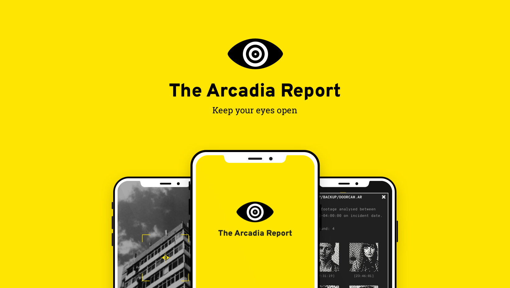
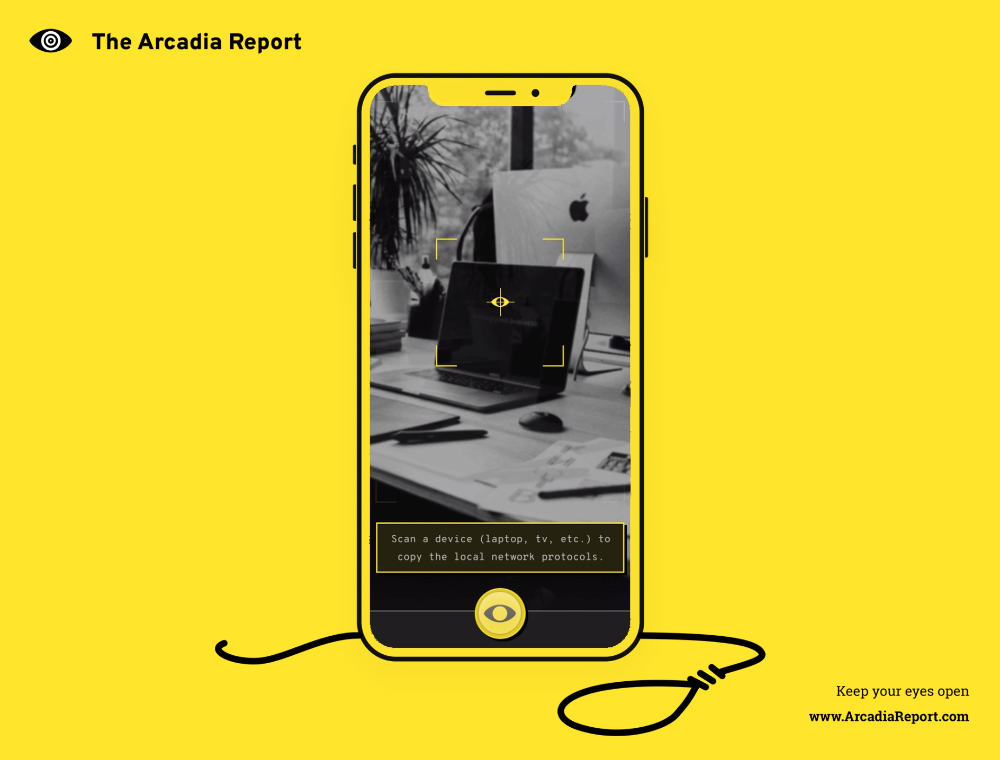
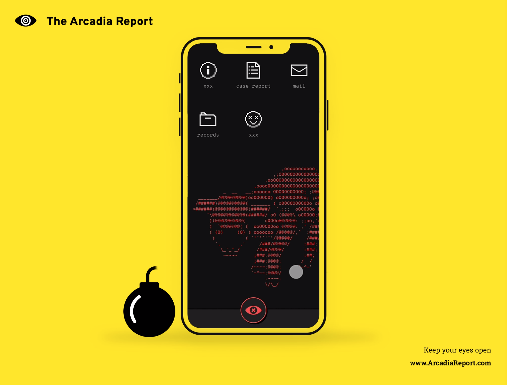

# Welcome to The Arcadia Report

- [What is The Arcadia Report?](#what-is-the-arcadia-report)
- [Join the Mystery](#join-the-mystery)
- [The Story So Far](#be-the-detective)
- [The Case Files](#the-case-files)
  - [CASE 0: Welcome to Arcadia](#case-0-welcome-to-arcadia)
  - [CASE 1: The End of the Beginning](#case-1-the-end-of-the-beginning)
- [Case Closed... for Now](#case-closed-for-now)

## What is The Arcadia Report?
The Arcadia Report is an immersive murder mystery unique to you, transforming your city into an escape room. You don’t read about a detective, you are the detective. Play anywhere, anytime as mystery invades reality. Travel to real world locations, unlock clues, and uncover the secrets of Arcadia as you delve into corrupted records of a failed startup with murderous consequences.

## The Story So Far
The Arcadia Report is the corrupted database of a failed startup. Someone is reigniting their quest to build an algorithm to solve crimes and attempting to crowdsource justice. You've been selected to take justice into your hands. It's up to you to piece together clues from the corrupted files to solve the mystery and uncover the truth as people connected to The Report turn up dead. Can you restore Arcadia and stop a serial killer?

### Join the Mystery
- [Learn more about The Arcadia Report](https://arcadiareport.com)
- [Join the Citizens Club for exclusive updates](https://arcadiareport.com/#subscribe)
- [See behind the scenes on the Redacted Report blog](https://medium.com/redacted-report)
- [Follow development on Itch.io](https://sayskez.itch.io/arcadia)
- [Twitter](https://twitter.com/ArcadiaReport)
- [Instagram](https://www.instagram.com/theArcadiaReport/)
- [Youtube](https://www.youtube.com/channel/UCLVY3TEkcohA-ZOaFLfae8Q)

---

# Be the Detective
Play the alpha prototype for the first cases right here. Just follow the instructions below to get started, no downloads necessary for case 0.

# The Case Files
**NOTE:** These are early visual prototypes without sound or in some cases animations. If something goes wrong, it is the prototype's fault, not yours. Please enjoy and let us know what you think at [welcome@arcadiareport.com](mailto:welcome@arcadiareport.com).

## CASE 0: Welcome to Arcadia

Imagine you've just downloaded the game and are starting it up for the first time. Follow the on screen prompts and attempt to start up Arcadia.

##### [Click here to play](https://invis.io/D4WG099ME3N)

### When You're Done
- Please take a 1-3 minutes to answer a few questions about your experience and help shape the future of The Arcadia Report [HERE](https://forms.gle/Nzjkk1bR9ckrTCCn8). Thank you!
- Enjoy? Dive straight into the next case below!

---

## CASE 1: The End of the Beginning

You've successfully restarted Arcadia, now the real mystery begins. Investigate the files and prove the death of Arcadia's CEO was anything but suicide by travelling to his apartment.

### Setup
**NOTE:** At this time Case 1 is only available on iOS devices. If you wish to play on Android or your PC, please let us know at [welcome@arcadiareport.com](mailto:welcome@arcadiareport.com).

1.  Download the Flinto app on your phone (free, yay!)
2.  **[Click here to download Case 1](https://sayskez.github.io/arcadia-report/ar-case1-prototype.flinto)**. Or scan the QR code below.
3.  Open the prototype file with the Flinto app.
4. Start investigating Arcadia!

### Prompts
**NOTE:** Due to the limits of the prototype, not all potential avenues of investigation are currently built. If you get stuck, it's the prototype's fault. Follow the prompts below to get the fullest taste of Case 1. 

1. Try reading the case file and following the lead on the suspect.
2. The suspect's emails may reveal more.
3. Can't unlock the victim's email? Try accessing the local files on the desktop.

**Once you unlock the location files:**
1. Does anyone look familiar in the CCTV footage? Add it to the report if you think so!
2. One of the files you find might have information that will unlock the victim's email.

**Once you unlock the emails:**
1. Is the victim allergic to anything? That could be a means for a murder.
2. Once you've added to files to the case report, you can skip to the end to see the resolution of the case.

### When You're Done
- Please take a 1-3 minutes to answer a few questions about your experience and help shape the future of The Arcadia Report [HERE](https://forms.gle/Nzjkk1bR9ckrTCCn8). Thank you!

---
---

# Case Closed... for Now
- Thanks for investigating The Arcadia Report! Please send any and all questions, comments, or feedback to [welcome@arcadiareport.com](mailto:welcome@arcadiareport.com).
- [Join the Citizens Club for exclusive updates](https://arcadiareport.com/#subscribe).
- The Arcadia Report is currently under active design & development by [Kezie Todd](https://kez.ie). Follow me on [Twitter](https://twitter.com/SaysKez), [Instagram](https://www.instagram.com/sayskez/), or [my blog](https://medium.com/@SaysKez) for the latest.